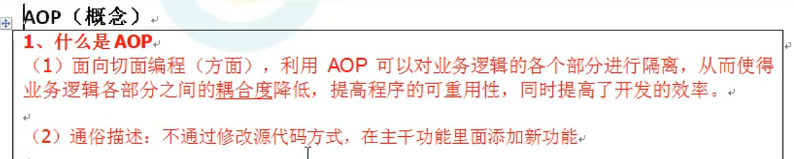
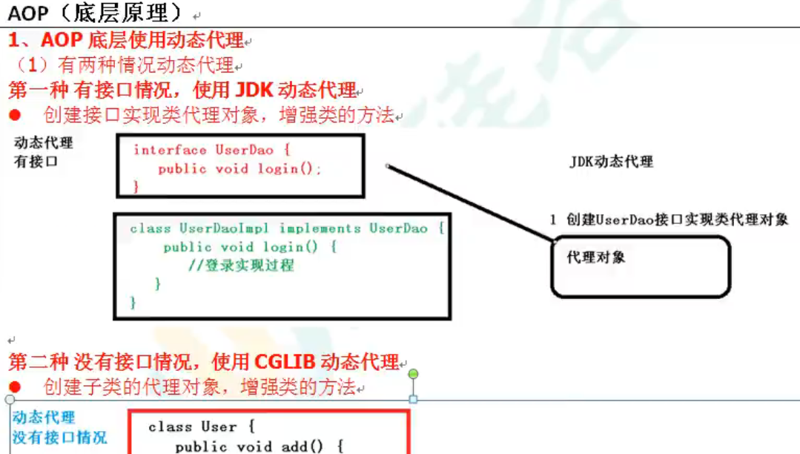

# spring5-demo1
##一、spring概述
##二、IOC
##三、AOP
###（1）AOP术语
1. aop概念
2. 连接点：类里面可以被增强的方法
3. 切入点：实际被增强的方法
4. 通知（增强）：实际增强的逻辑部分，分为：
- 前置通知
- 后置通知
- 环绕通知
- 异常通知
- 最终通知
5. 切面：把通知应用到切入点的过程
###（2）基于AspectJ框架实现AOP操作
1. 实现方式：
- xml配置文件
- 注解方式
   
2. 切入点表达式
- 作用：知道对哪个类的哪个方法进行增强。
- 切入点表达式：ps:execution(* com.company.spring5.aop.aopanno.User.add(..))

##四、jdbcTemplate
##五、事务
###(1)事务的操作过程
```
try{
            //1.开启事务
            
            //2.进行业务操作
            
            userDao.reduceMoney();
            
            //模拟异常
            int i=10/0;

            userDao.addMoney();

            //3.没有异常，则提交事务
        }catch (Exception e){
            //4.出现异常，事务回滚
        }
```
###(2)spring事务管理
1. 事务一般添加到Javaee三层结构里的Service层（业务逻辑层）。
2. 在spring进行事务管理操作
- 有两种方式：编程式事务管理和声明式事务管理（使用）。
3. 声明式事务管理（底层使用AOP原理）
- 基于注解方式（使用）
- 基于xml配置文件方式
4. 注解声明式事务管理（实现操作）
- 在spring配置文件中，配置事务管理器、引入名称空间tx、开启事务注解
- 在所需类或方法上添加事务注解
5. 事务的传播行为
- spring默认是REQUIEED，即无事务则创建一个，否则就加入当前事务。
6. 事务的隔离级别
- 为解决脏读、不可重复读、虚读
- MySQL默认是可重复读
- Oracle默认是读已提交
7. 事务的另外4个参数
- timeout超时时间：事务一定时间内未提交就要回滚；spring默认值-1（即不超时）
- readOnly是否只读：读即查询，默认false。
- rollBackFor回滚：设置出现哪些异常进行事务回滚。
- noRollBackFor不回滚：设置出现哪些异常不进行事务回滚。
8. 完全注解声明式事务管理
9. Spring5框架核心容器支持@Nullable注解：表示方法、属性等可为空
10. Spring5框架核心容器支持函数式风格GenericApplicationContext

